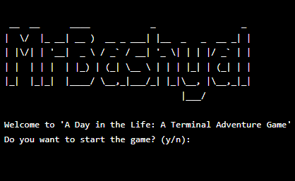

 A Day in the Life: A Terminal Adventure Game
==============================================



 Overview
-----------

"A Day in the Life: A Terminal Adventure Game" is a simple text-based adventure game written in Python. The game simulates a day in the life of a character, allowing the player to make choices that affect the character's day and ultimately the outcome of the game.

 How to Play
--------------

1. **Start the Game**: Run the game and choose to start the game from the start menu.
2. **Make Choices**: Throughout the game, you will be presented with various choices that will affect the character's day. Choose wisely!
3. **Progress Through the Day**: The game progresses through different times of the day: morning, afternoon, evening, and night.
4. **End of Day**: At the end of each day, you can choose to continue to the next day or end the game.

 Game Flow
-------------

1. **Start Menu**: The game begins with a start menu where you can choose to start the game or exit.
2. **Morning Routine**: Choose between having breakfast, going for a jog, or skipping school.
3. **Afternoon Activities**: Choose between studying or playing a game.
4. **Evening Activities**: Choose between having dinner or relaxing and reading a book.
5. **End of Day**: The day ends, and you can choose to continue to the next day or end the game.

### Example Choices

* **Morning**:
	+ Have breakfast
	+ Go for a jog
	+ Skip school
* **Afternoon**:
	+ Study
	+ Play a game
* **Evening**:
	+ Have dinner
	+ Relax and read a book

 Game Over
------------

If you choose to skip school, the game will end with a message indicating that the character died uneducated.
Installation
--------------

1. Clone the repository:
	```sh
	git clone https://github.com/Prarambha369/pygame.git
	```

2. Navigate to the project directory:
	```sh
	cd pygame
	```
 Running the Game
-------------------

To run the game, execute the following command:

```sh
python game.py
```

 Requirements
--------------

* Python 3.x

 Acknowledgements
-----------------

Thank you for playing "A Day in the Life: A Terminal Adventure Game". Have a great day!